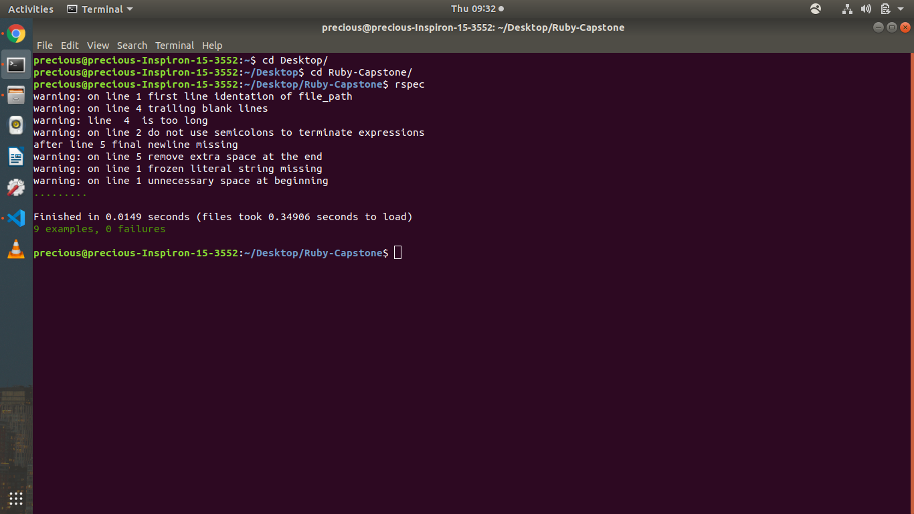

# Ruby-Capstone
This is solo project about making or simulating some ruby linting codes that shows common errors
This is done with a demonstration of some object oriented programming comcepts (O.O.P)
Using classes and methods to declare or write the lints
There's also the application of Rspec for demonstration and testing of these linting algorithms
the Rspec test fails if there is no error test for it

the test-files folder contains testing files with errors so the linter can catch them to demonstrate it's functionality sample.rb and file_path.rb

The Rspec will return an error message if it does not find an error that matches with it

but that doesn't mean it doesn't respond. It needs to find it's matching error to return the correct value

# USING THIS FILE

# step 1 clone this folder from my repo

# step 2 open this document with a Vscode editor

# step 3 run the check_errors.rb and see how the linter catchees the errors. Also read the program to know how it works

# step 4 the test-files folders contain the sample files for testing the linters, they already contain errors. if you want to use another file to test, create a ruby file and add link it's path to the main.rb and the testing_spec.rb

# step 5 run the check_errors.rb again and see that it caught the errors, then run the test_spec.rb and see that the tests work; if the test fails, then it didn't catch the errors it was given

# LINTERS CREATED
I created 8 linters

1 semicolon error: An array or expression should not end with a semicolon
i.e array = [1, 2, 3, 4, 5]; even if it's a string

2 Line length linter
a line shouldn't be too lengthy i.e at most 80 characters per line. I think i just broke the rule here. lol

3 white space linter
unnecesssary spaces in lines are bad practices
i.e space before the beginning of an expression except for the sake of identation purposes

4 Blank first lint
it is not a good practice to leave the first line of a script blank

5 spacing lint
it is also not good to end an expresssion with a blank unncessary space
i.e array = [1, 2, 3, 4, 5]  'see the spacing befor this statement'

6 line end lint
it is a bad practice to leave multiple empty lines below the last line with characters
one at least is enough

# Built With

-rubocop, VScode & ruby Rspec

# Prerequisites
Visual Studio code editor

# Authors

👤 **Precious**

- Github: (https://github.com/evabanegacom)
- Linkedin:(https://www.linkedin.com/in/precious-udegbue-a3468314a/)

# 🤝 Contributing
Contributions, issues and feature requests are welcome!

Feel free to check the issues page.

Show your support
Give a ⭐️ if you like this project!

# Acknowledgments

Ruby's linting methods
etc
📝 License
This project is MIT licensed.
